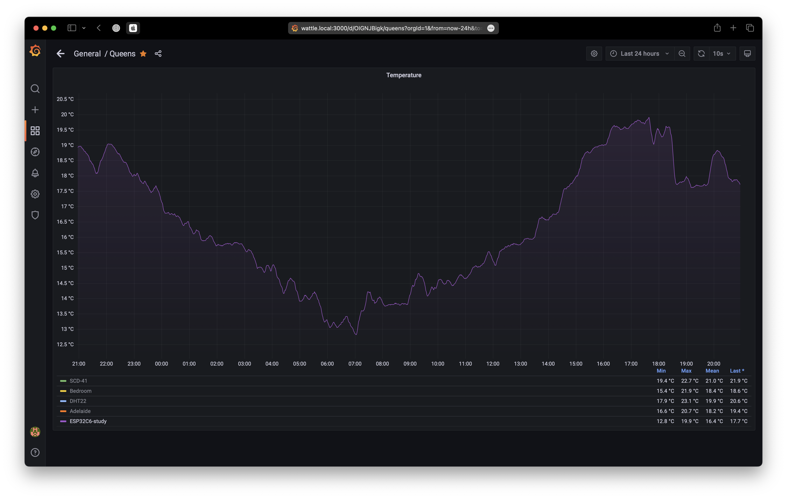

# ESP32-C6 Temperature exporter

An ESP32-C6 temperature exporter for Prometheus using the internal temperature readings.



## Hardware

* [ESP32-C6 Sparkfun Qwiic](https://www.sparkfun.com/products/22925)
* Optional: [ST25DV16K active NFC](https://www.adafruit.com/product/4701)

## Software

* [Prometheus/Grafana Docker containers for Raspberry Pi](https://github.com/sighmon/prometheus-grafana-raspberry-pi)

## Setup

**WiFi**:

* Copy the secrets file: `cp secrets.tmpl.h secrets.h`
* Fill in your SSID and password in `secrets.h`
* **Note**: the ESP32-C6 only connects to a 2.4 GHz network

**Arduino**:

* Download the latest version of Arduino from https://www.arduino.cc
* Follow the [ESP32-C6 Arduino setup guide](https://docs.sparkfun.com/SparkFun_Qwiic_Pocket_Dev_Board_ESP32_C6/software_setup/)
* Optional: connect the Qwiic connector from the ESP32-C6 to the ST25DV16K
* Connect your ESP32 via USB
* Now try `Upload` to send the code to your ESP32

## http response

Once your ESP32 has connected to your SSID, it will respond over port 80 with a [Prometheus](https://prometheus.io) response. e.g. `curl 192.168.1.100:80/metrics`

```bash
# HELP ambient_temperature Ambient temperature
# TYPE ambient_temperature gauge
ambient_temperature 31.00
# HELP temperature Sensor temperature
# TYPE temperature gauge
temperature 46.00
```

## Grafana

If you're graphing this using Grafana, you might want to smoothen out the readings.

I've been using this code to average it over 10 minutes:

`avg_over_time(ambient_temperature{location="ESP32C6-study"}[10m])`

